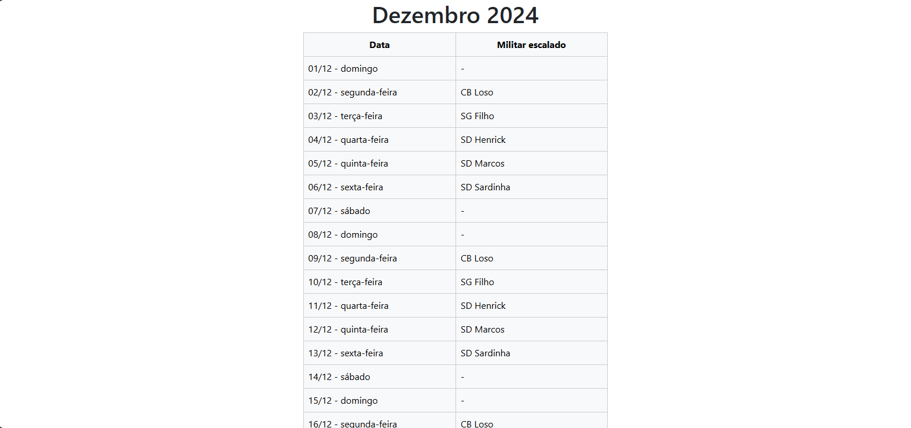

# escala_de_servico
Este é um projeto feito com o objetivo de montar e exibir uma escala de serviço ao longo de um mês, de modo que cada dia de segunda a sexta vai conter o nome da pessoa que estará de serviço.

Este projeto utiliza:
- python
- Django
- Bootstrap 5
- banco de dados: SQLite (até agora)

